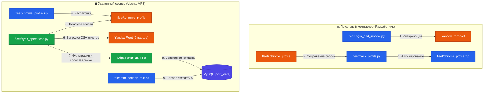

# 🛠️ Руководство по автоматизации и синхронизации задач сервисных инженеров

Добро пожаловать в обновленное интерактивное руководство! Ниже приведена полная архитектура и инструкции по запуску системы автоматизации.

---

## 📊 Схема движения данных (Архитектура)

Ниже представлена визуализация того, как данные о выполненных задачах курьеров и вендингов переносятся из Яндекса в вашу базу данных и отображаются в Telegram-боте:



---

## 📂 Структура проекта

Проект разделен на тематические папки:
- **[fleet/](file:///c:/Users/huras/OneDrive/Рабочий стол/Agent_Playground/fleet)** — логика интеграции с Яндекс.Флит.
  - `sync_office_stations.py`, `sync_operations.py`, `automate_tasks.py` — основные скрипты автоматизации.
  - `update_city_svod.py` — обновление и синхронизация сводных файлов городов данными июня.
  - `yandex_fleet_downloader.py`, `login_and_inspect.py`, `pack_profile.py` — утилиты для скачивания отчетов и управления сессиями.
  - `inputs/` и `outputs/` — папки со скачанными данными и сгенерированными отчетами Excel.
  - `.chrome_profile/` — папка авторизации Chrome.
- **[debug_tools/](file:///c:/Users/huras/OneDrive/Рабочий стол/Agent_Playground/debug_tools)** — вспомогательные утилиты разработки, отладки и тестирования.
  - `run_all_cities.py` — пакетный запуск обновления отчетов для всех городов.
  - `verify_final_excel.py` — автоматическая верификация обновленных сводных отчетов.
- **[telegram_bot/](file:///c:/Users/huras/OneDrive/Рабочий стол/Agent_Playground/telegram_bot)** — код и запуск Telegram-бота (`app_test.py`).
- **[diy_meeting_agent/](file:///c:/Users/huras/OneDrive/Рабочий стол/Agent_Playground/diy_meeting_agent)** — ИИ-ассистент для онлайн-встреч (интеграция Whisper для локального распознавания, RAG поиск по базе знаний через Ollama, генерация саммари созвонов, синтез речи TTS).
- **Корень проекта** — общие конфигурации ([config.json](file:///c:/Users/huras/OneDrive/Рабочий стол/Agent_Playground/config.json), [service_account.json](file:///c:/Users/huras/OneDrive/Рабочий стол/Agent_Playground/service_account.json)), схемы ([schema.md](file:///c:/Users/huras/OneDrive/Рабочий стол/Agent_Playground/schema.md), [reports_schema.md](file:///c:/Users/huras/OneDrive/Рабочий стол/Agent_Playground/reports_schema.md)) и инструкции.

---

## 🛠️ Что было реализовано

### 1. ⚙️ Конфигурация системы
Все параметры подключения и маппинга сосредоточены в файле [config.json](file:///c:/Users/huras/OneDrive/Рабочий стол/Agent_Playground/config.json):
* **MySQL:** Реквизиты подключения к базе данных на хостинге Timeweb (`vh446.timeweb.ru`).
* **Google Sheets:** ID таблиц для синхронизации текущих задач и лога отключенных аппаратов.
* **Yandex Parks:** Уникальные идентификаторы (`park_id`) для всех 9 городов вещания.
* **Courier Mapping:** Таблица автоматического сопоставления ФИО курьеров со служебными именами чатов.

### 2. 📑 Автоматизация Google Таблиц
В скрипте [fleet/automate_tasks.py](file:///c:/Users/huras/OneDrive/Рабочий стол/Agent_Playground/fleet/automate_tasks.py) реализовано:
* **Лист «Текущие задачи»:** Полное автоматическое заполнение и стилизация по каждому городу.
* **Лист «Отключенные аппараты» (Вертикальный стек):**
  * **Утренний запуск:** Освобождает место на листе, удаляя ровно 8 крайних левых колонок (защита от переполнения листа), и вставляет свежую таблицу справа.
  * **Дневной/Вечерний запуски:** Новые данные добавляются/обновляются в сегодняшнем столбце под соответствующей временной меткой.
  * **Интеллектуальная перезапись и дедупликация:** Временной диапазон определяется по астрономическому локальному времени города (Утро < 12:00, День < 17:00, Вечер >= 17:00). Если секция для этого времени уже существует (например, при повторном запуске после сбоя), она перезаписывается свежими данными вместо слепого добавления вниз, исключая появление дубликатов. Лишние старые строки автоматически затираются.
  * **Окрашивание:** Все критические задачи автоматически заливаются пастельно-красным цветом.
  * **Отслеживание пустых станций:**
    * Первое появление пустой станции фиксируется в локальном кэше истории [fleet/inputs/empty_stations.json](file:///c:/Users/huras/OneDrive/Рабочий стол/Agent_Playground/fleet/inputs/empty_stations.json).
    * Если станция остается пустой более **48 часов**, в отчет Excel и Google Таблицу в колонку **H** («Комментарий») автоматически добавляется метка: `[!] Пустой более 48ч (с ДД.ММ ЧЧ:ММ)`.
    * Как только аппарат пополняется и исчезает из категории «Пустые» в новом отчете, он автоматически удаляется из истории.

### 3. 🌐 Автоматическая выгрузка из Yandex Fleet (Playwright)
* Логика скачивания вынесена в модуль [fleet/yandex_fleet_downloader.py](file:///c:/Users/huras/OneDrive/Рабочий стол/Agent_Playground/fleet/yandex_fleet_downloader.py).
* **Повышенная надежность:** Для предотвращения сетевых сбоев и ошибок подключения к системным прокси добавлен аргумент `--no-proxy-server`. Логика скачивания файлов вендингов и выручки обернута в цикл из 3-х попыток повтора с экспоненциальной задержкой.
* Все загруженные файлы помещаются во [fleet/inputs/](file:///c:/Users/huras/OneDrive/Рабочий стол/Agent_Playground/fleet/inputs). При критических ошибках сессии скрипт сохраняет скриншот ошибки в папку [debug_tools/](file:///c:/Users/huras/OneDrive/Рабочий стол/Agent_Playground/debug_tools).
* **CLI-интерфейс:** Добавлена возможность автономного запуска `yandex_fleet_downloader.py` из консоли для скачивания сырых отчетов выручки без их последующей обработки или синхронизации.

### 4. 🗄️ Синхронизация с базой данных MySQL (post_data)
Скрипт [fleet/sync_operations.py](file:///c:/Users/huras/OneDrive/Рабочий стол/Agent_Playground/fleet/sync_operations.py):
* Импортирует выполненные задачи (`Итоговый статус == "Выполнена"`).
* Маппит типы задач: `"Загрузка аппарата"` ➡️ `"Пополнение"`, `"Выгрузка аппарата"` ➡️ `"Выгрузка"`, остальные ➡️ `"Сервисная заявка"`.
* Записывает даты в текстовом формате `ДД.ММ.ГГГГ` для интеграции с ботом.
* **Защита от дубликатов:** Применяется проверка сигнатуры `Yandex Task ID` перед вставкой.

### 5. 📊 Выгрузка и анализ станций «За офисом»
Скрипт [fleet/sync_office_stations.py](file:///c:/Users/huras/OneDrive/Рабочий стол/Agent_Playground/fleet/sync_office_stations.py):
* Выгружает отчеты выручки, подсчитывает аппараты в офисах и на локациях.
* Создает Excel-отчет во [fleet/outputs/](file:///c:/Users/huras/OneDrive/Рабочий стол/Agent_Playground/fleet/outputs) со вкладкой «Общее» и вкладками по городам.
* Сопоставляет серийные номера из ранее загруженных файлов `fleet/inputs/vendings_{park_name}.csv`.

### 6. 📈 Синхронизация сводных отчетов городов (Excel)
Скрипт [fleet/update_city_svod.py](file:///c:/Users/huras/OneDrive/Рабочий стол/Agent_Playground/fleet/update_city_svod.py) синхронизирует Excel-отчеты городов с данными выручки и аренды за Июнь 2026 года по алгоритму:
* **Фильтрация**: Оставляет только активные аппараты со статусом `office_status == "placed"` и датой демонтажа `2222-02-01` или `01.02.2222`.
* **Лист «Общий»**: Вставляет новые колонки июня (50-я выручка, 51-я аренды), копируя форматирование из мая. Удаляет неактивные аппараты, обновляет релоцированные и дописывает новые с сохранением истории и стилей.
* **Лист «Аналитика новых аппаратов»**: Находит новые аппараты (установка за последние 5 месяцев), очищает старые строки, прописывает обновленную формулу `FILTER` по диапазону `A:AY` с диапазоном массива `Ref` под количество записей, копирует условное форматирование на новую колонку выручки.
* **Лист «Просадка выручки»**: Полностью копирует данные с листа «Общий» со сдвигом вправо на 1 столбец. В первом столбце прописывает формулу проверки просадки выручки `=IF(AY{row} < AW{row}*0.7, "Да", "Нет")`. Скрывает строки со значением `"Нет"` и включает автофильтр Excel.
* **Лист «Нулевые станции»**: Вычисляет аппараты, установленные более 5 месяцев назад, у которых выручка за последние 5 месяцев подряд (февраль-июнь) была менее 500 рублей. Записывает формулу `FILTER` по диапазону `A2:AY{total_rows}`.

### 7. ⏱️ Кэширование норм заполненности (Оптимизация скорости)
Для исключения ресурсоемких выгрузок в процессе создания задач:
* **Автономная выгрузка**: Создан выделенный скрипт [fleet/sync_fullness_norms.py](file:///c:/Users/huras/OneDrive/Рабочий стол/Agent_Playground/fleet/sync_fullness_norms.py), собирающий данные `SLA %` с сервисных карт Яндекса по расписанию и сохраняющий их в JSON-кэш [fleet/inputs/fullness_norms.json](file:///c:/Users/huras/OneDrive/Рабочий стол/Agent_Playground/fleet/inputs/fullness_norms.json).
* **Мгновенный запуск задач**: Скрипт [fleet/automate_tasks.py](file:///c:/Users/huras/OneDrive/Рабочий стол/Agent_Playground/fleet/automate_tasks.py) переведен на чтение из этого кэша, за счет чего время его работы сократилось с 5-7 минут до **60 секунд** на все 9 городов, при этом полностью исключен запуск Playwright/Chromium во время обновления таблиц.

---

## 🚀 Команды для запуска

> [!NOTE]
> Все команды выполняются из корня проекта с использованием пакетного менеджера `uv`, что гарантирует переносимость окружения.

### ⏱️ Синхронизация и кэширование норм заполненности

* **Выгрузить и обновить кэш норм заполненности (`fullness_norms.json`) по всем паркам:**
  ```bash
  uv run --with pandas --with playwright python fleet/sync_fullness_norms.py
  ```

---

### 🎙️ ИИ-ассистент для онлайн-встреч (DIY Meeting Agent)

Этот модуль запускает локального ИИ-помощника для онлайн-встреч. Он слушает ваш микрофон и вывод системы (голоса коллег), транскрибирует речь локально через Whisper, ищет ответы по базе отчетов (RAG) через Ollama и может озвучивать их синтезированным голосом (TTS).

#### 1. Требования (Ollama):
* Убедитесь, что запущен сервер **Ollama** (по умолчанию `http://localhost:11434`).
* Должны быть скачаны модели для логики и векторного поиска:
  ```bash
  ollama pull qwen2.5:7b
  ollama pull nomic-embed-text
  ```
  *(Дистрибутив установщика Ollama находится в папке [debug_tools/OllamaSetup.exe](file:///c:/Users/huras/OneDrive/Рабочий стол/Agent_Playground/debug_tools/OllamaSetup.exe)).*
* Положите файлы отчетов (`.csv`, `.xlsx`, `.pdf`, `.md`, `.txt`) в папку [diy_meeting_agent/knowledge_base/](file:///c:/Users/huras/OneDrive/Рабочий стол/Agent_Playground/diy_meeting_agent/knowledge_base) — они будут использоваться как источник знаний.

#### 2. Запуск локального веб-сервера:
Выполните из корня проекта следующую команду (пакеты установятся автоматически):
```bash
uv run --with fastapi --with uvicorn --with pydantic --with jinja2 --with httpx --with pyaudiowpatch --with numpy --with faster-whisper --with edge-tts --with miniaudio --with sounddevice --with websockets python -m diy_meeting_agent.server
```
После успешного запуска откройте интерфейс в браузере: **`http://127.0.0.1:8000`**

#### 3. Обновление индекса базы знаний (RAG):
Индексация базы запускается автоматически при старте новой встречи. Но если вы добавили новые файлы в папку базы знаний и хотите обновить векторный индекс вручную при запущенном сервере, выполните:
```bash
uv run --with httpx python debug_tools/trigger_index.py
```

---

### Синхронизация базы данных MySQL

* **Ежедневный автоматический запуск (вчерашний день):**
  ```bash
  uv run --with pandas --with pymysql --with playwright python fleet/sync_operations.py
  ```
* **Запуск за конкретную дату (например, 22 июня 2026):**
  ```bash
  uv run --with pandas --with pymysql --with playwright python fleet/sync_operations.py --date 2026-06-22
  ```
* **Только импорт уже скачанных файлов из папки `inputs` (без повторной выгрузки из Яндекса):**
  ```bash
  uv run --with pandas --with pymysql python fleet/sync_operations.py --no-download
  ```

### Выгрузка и фильтрация станций «За офисом»

* **Ежедневный запуск за предыдущий день (вчера):**
  ```bash
  uv run --with playwright --with pandas --with openpyxl python fleet/sync_office_stations.py
  ```
* **Запуск за конкретную дату (например, 25 июня 2026):**
  ```bash
  uv run --with playwright --with pandas --with openpyxl python fleet/sync_office_stations.py --date 2026-06-25
  ```
* **Генерация отчета без обращения к Яндекс.Флот (оффлайн режим по локальным файлам):**
  ```bash
  uv run --with playwright --with pandas --with openpyxl python fleet/sync_office_stations.py --no-download
  ```

### Обновление Google Таблиц

* **Полный цикл (выкачивание данных и обновление таблиц):**
  ```bash
  uv run --with pandas --with numpy --with gspread --with google-auth --with requests --with openpyxl --with playwright python fleet/automate_tasks.py --download
  ```

### Прямое скачивание отчетов выручки Yandex Fleet (без обработки)

Скрипт [yandex_fleet_downloader.py](file:///c:/Users/huras/OneDrive/Рабочий стол/Agent_Playground/fleet/yandex_fleet_downloader.py) поддерживает запуск напрямую через консоль:

* **Скачать отчеты выручки по всем паркам за вчера:**
  ```bash
  uv run --with playwright python fleet/yandex_fleet_downloader.py
  ```
* **Скачать отчеты за конкретную дату (например, 29 июня 2026):**
  ```bash
  uv run --with playwright python fleet/yandex_fleet_downloader.py --date 2026-06-29
  ```
* **Скачать отчет только для определенного парка (например, Омск):**
  ```bash
  uv run --with playwright python fleet/yandex_fleet_downloader.py --date 2026-06-29 --park Омск
  ```

### 📊 Интерактивные выгрузки и аналитические отчеты (HTML)

В системе реализовано пять интерактивных HTML-инструментов для детальной бизнес-аналитики и визуализации:

#### 1. Анализ выручки по категориям Jewelry
Скрипт анализирует распределение категорий `jewelry` в разрезе франшиз (столбец `franchise`) по данным из отчетов выручки и формирует современный интерактивный дашборд.
* **Запуск с выгрузкой свежих данных (из Яндекса):**
  ```bash
  uv run --with pandas --with playwright python fleet/generate_revenue_charts.py
  ```
* **Запуск в оффлайн-режиме (по скачанным файлам из inputs):**
  ```bash
  uv run --with pandas python fleet/generate_revenue_charts.py --no-download
  ```
* **Результат:** [fleet/outputs/revenue_analysis.html](file:///c:/Users/huras/OneDrive/Рабочий стол/Agent_Playground/fleet/outputs/revenue_analysis.html)

#### 2. Геопространственная интерактивная карта аппаратов (Folium Map)
Скрипт сопоставляет данные координат из списков вендингов с финансовыми показателями из отчетов выручки и создает карту с цветными маркерами аппаратов (по категории `jewelry`) на базе библиотеки Folium.
* **Запуск:**
  ```bash
  uv run --with pandas --with folium python fleet/create_device_map.py
  ```
* **Результат:** [fleet/outputs/devices_map.html](file:///c:/Users/huras/OneDrive/Рабочий стол/Agent_Playground/fleet/outputs/devices_map.html)

#### 3. Анализ оборачиваемости ячеек (Cell Turnover Dashboard)
Скрипт анализирует параметр оборачиваемости ячеек `cell_turnover` по всем городам, фильтрует неактивные и демонтированные аппараты, выводит выручку, число аренд и оборачиваемость в виде интерактивного дашборда.
* **Особенности:**
  * Интерактивная сортировка таблицы по клику на заголовки столбцов (по возрастанию / убыванию) в реальном времени.
  * Вывод количества аренд (orders) и выручки аппарата (fact) перед оборачиваемостью ячеек.
  * Столбчатый график средней оборачиваемости по городам с возможностью переключения сортировки (по возрастанию / убыванию).
  * Фильтрация по городам, текстовый поиск по номеру/адресу/названию.
  * **Экспорт в CSV:** Полнофункциональный экспорт отфильтрованных данных с использованием `Blob` в браузере (устранена проблема обрезания данных по символу `#` в адресах, из-за которой ранее выгружалась только часть станций Омска).
* **Запуск с выгрузкой свежих данных (из Яндекса):**
  ```bash
  uv run --with pandas --with playwright python fleet/sync_and_analyze_turnover.py
  ```
* **Запуск в оффлайн-режиме (по скачанным файлам из inputs):**
  ```bash
  uv run --with pandas python fleet/sync_and_analyze_turnover.py --no-download
  ```
* **Результат:** [fleet/outputs/cell_turnover_analysis.html](file:///c:/Users/huras/OneDrive/Рабочий стол/Agent_Playground/fleet/outputs/cell_turnover_analysis.html) (копия сохраняется в корень проекта: [cell_turnover_analysis.html](file:///c:/Users/huras/OneDrive/Рабочий стол/Agent_Playground/cell_turnover_analysis.html))

#### 4. Анализ локаций Чебоксары ML (ML-прогнозирование локаций)
Скрипт выполняет QA-аудит данных потенциальных локаций для павербанков, парсит координаты и формирует интерактивный дашборд со встроенной картой Leaflet, графиками распределения типов точек, прогнозом выручки и списком топ-локаций.
* **Запуск:**
  ```bash
  uv run --with pandas --with openpyxl python debug_tools/generate_dashboard.py
  ```
* **Результат:** [fleet/outputs/analysis_results.html](file:///c:/Users/huras/OneDrive/Рабочий стол/Agent_Playground/fleet/outputs/analysis_results.html) (копии сохраняются также как [ML_Чебоксары.html](file:///c:/Users/huras/OneDrive/Рабочий стол/Agent_Playground/ML_Чебоксары.html) и в корень проекта: [analysis_results.html](file:///c:/Users/huras/OneDrive/Рабочий стол/Agent_Playground/analysis_results.html))

#### 5. SLA заполняемости аппаратов (SLA Fill Rate)
Интерактивный аналитический отчет, сравнивающий уровни доступности и заполняемости ячеек аппаратов павербанками по тирам ("Было" / "Сейчас" / "Предложение"). Используется для оптимизации визитов сервисных инженеров и улучшения клиентского опыта.
* **Результат:** [fleet/analys/sla_zapolnaemost.html](file:///c:/Users/huras/OneDrive/Рабочий стол/Agent_Playground/fleet/analys/sla_zapolnaemost.html)

#### 6. Интерактивный отчет BZ (2025-2026)
Скрипт формирует полноценный интерактивный дашборд на основе исторических данных из листа `Общее` Excel-отчета и категорий Jewelry из последних выгрузок Yandex Fleet. Дашборд отображает графики динамики выручки, количества станций, средней выручки на станцию (RPS) и круговые диаграммы структуры Jewelry по всей сети и для отдельных городов.
* **Скрипт генерации:** [fleet/generate_report.py](file:///c:/Users/huras/OneDrive/Рабочий стол/Agent_Playground/fleet/generate_report.py)
* **HTML-шаблон:** [fleet/templates/dashboard_template.html](file:///c:/Users/huras/OneDrive/Рабочий стол/Agent_Playground/fleet/templates/dashboard_template.html)
* **Функция рендеринга:** Функция `render_html(data)` в [fleet/generate_report.py](file:///c:/Users/huras/OneDrive/Рабочий стол/Agent_Playground/fleet/generate_report.py) загружает шаблон `dashboard_template.html`, преобразует собранную статистику в JSON и подставляет её на место плейсхолдера `{{ REPORT_DATA }}` в HTML.
* **Запуск с выгрузкой свежих данных (из Яндекса):**
  ```bash
  uv run --with pandas --with python-pptx --with playwright --with openpyxl python fleet/generate_report.py
  ```
* **Запуск в оффлайн-режиме (по локальным файлам):**
  ```bash
  uv run --with pandas --with python-pptx --with openpyxl python fleet/generate_report.py --no-download
  ```
* **Результат:** [fleet/report.html](file:///c:/Users/huras/OneDrive/Рабочий стол/Agent_Playground/fleet/report.html)

---

## 🖥️ Деплоймент на сервер (VPS/VDS)

Чтобы скрипты выполнялись автономно 24/7 по расписанию:
1. Выполните вход в Яндекс-аккаунт локально на компьютере, запустив:
   ```bash
   python fleet/login_and_inspect.py
   ```
2. Упакуйте полученный профиль в архив:
   ```bash
   python fleet/pack_profile.py pack
   ```
3. Скопируйте проект и файл `chrome_profile.zip` (созданный в `fleet/`) на сервер и распакуйте:
   ```bash
   python3 fleet/pack_profile.py unpack
   ```
4. Установите зависимости Playwright на сервере:
   ```bash
   uv run --with playwright playwright install --with-deps chromium
   ```

> [!IMPORTANT]
> Полная пошаговая инструкция по настройке Ubuntu-сервера, установке пакетов и добавлению задач в планировщик `cron` находится в файле **[DEPLOY.md](file:///c:/Users/huras/OneDrive/Рабочий стол/Agent_Playground/DEPLOY.md)**.

---

## ⏰ Фильтрация «Не в сети» по часовым поясам и рабочему времени

Для исключения лишних задач «Не в сети» (когда точка закрыта) в [fleet/automate_tasks.py](file:///c:/Users/huras/OneDrive/Рабочий стол/Agent_Playground/fleet/automate_tasks.py) реализована следующая логика:

1. **Разница во времени от МСК:**
   * **Омск:** +3 часа
   * **Магнитогорск, Сургут:** +2 часа
   * **Ижевск, Ульяновск:** +1 час
   * **Рязань, Киров, Чебоксары, Орёл:** время московское (+0)

2. **Алгоритм проверки:**
   * Скрипт получает текущее время МСК и пересчитывает его в локальное время целевого города.
   * Для каждого аппарата в статусе `not_responding` считываются рабочие часы: `LocationOpenTime` (время открытия) и `LocationCloseTime` (время закрытия).
   * Если текущее локальное время города находится вне рабочего интервала, задача «Не в сети» для этого аппарата отфильтровывается (не создается).
   * Логика корректно обрабатывает ночные смены с переходом через полночь (например, с `15:00` до `03:00`).
   * Если время открытия или закрытия не указано (пустое значение), аппарат считается работающим круглосуточно.

---

## 📊 Автоматическое заполнение Годового отчета (Excel)

В дополнение к интерактивному дашборду, разработан скрипт автоматической синхронизации фактических данных за июнь 2026 года в Excel-файле:
**[Годовой_отчет_фин_и_сревис_май_2026_с_прогнозом.xlsx](file:///c:/Users/huras/OneDrive/Рабочий%20стол/Agent_Playground/fleet/analys/Годовой_отчет_фин_и_сревис_май_2026_с_прогнозом.xlsx)**

### Что сделано:
1. **Скрипт синхронизации**: Оптимизирован скрипт [sync_annual_report.py](file:///c:/Users/huras/OneDrive/Рабочий%20стол/Agent_Playground/fleet/sync_annual_report.py).
2. **Точные расчеты**: Из CSV-файлов выгрузки Яндекс.Флит (от 29 июня 2026 г.) извлечены фактические показатели по правилам:
   - **Выручка** (сумма всех ячеек в столбце `fact` для учета всех продаж за период)
   - **Количество активных станций** (количество строк, где `office_status` = `placed` и в `remove_date` стоит заглушка активного аппарата `2222-02-01` или `01.02.2222`)
   - **Выручка на один аппарат (RPS)** (Выручка / Кол-во станций)
3. **Обновление листов**:
   - На листе **`Общее`** заполнен столбец **AE** (соответствующий июню 2026 г.) для всех 9 городов. Общие формулы сумм и средних показателей сохранены и пересчитываются.
   - На листах **индивидуальных городов** (Омск, Рязань, Ижевск и др.) заполнены соответствующие June-колонки. Для **Орла** учтена индивидуальная структура листа (Col F для выручки/RPS и Col Q для станций).
4. **Ограничения**: Согласно указанию, показатели «Заполненность», «Доступность» и «Рентабельность» не изменялись и не перезаписывались.

### Как запустить синхронизацию:
```bash
uv run --with openpyxl --with pandas python fleet/sync_annual_report.py --no-download
```
*Примечание: Если файл Excel открыт и заблокирован, скрипт автоматически создаст сохраненную копию с суффиксом `_1.xlsx`.*

---

## 🔄 Двухэтапный конвейер обновления данных (Pipeline)

Для получения актуального интерактивного дашборда необходимо соблюдать правильный порядок запуска скриптов:

1. **Шаг 1: Заполнить Excel-отчет фактическими данными за новый месяц:**
   ```bash
   uv run --with openpyxl --with pandas python fleet/sync_annual_report.py --no-download
   ```
   *(Этот шаг рассчитывает выручку и станции из Yandex Fleet CSV и записывает их в [Годовой_отчет_фин_и_сревис_май_2026_с_прогнозом.xlsx](file:///c:/Users/huras/OneDrive/Рабочий%20стол/Agent_Playground/fleet/analys/Годовой_отчет_фин_и_сревис_май_2026_с_прогнозом.xlsx))*

2. **Шаг 2: Сгенерировать интерактивный HTML-дашборд:**
   ```bash
   uv run --with pandas --with python-pptx --with openpyxl python fleet/generate_report.py --no-download
   ```
   *(Этот шаг читает обновленный Excel-файл и пересобирает [fleet/report.html](file:///c:/Users/huras/OneDrive/Рабочий стол/Agent_Playground/fleet/report.html) со всеми актуальными графиками).*

---

## 💰 Расчет выплат курьерам (Объединение Яндекс.Про и Формы)

Скрипт **[generate_employee_report.py](file:///c:/Users/huras/OneDrive/Рабочий стол/Agent_Playground/fleet/generate_employee_report.py)** объединяет данные о выполненных задачах из Яндекс.Про (выгрузки CSV) и Excel-формы сервисного инженера, рассчитывает выплаты и формирует красивую ведомость Excel.

### Возможности и особенности:
1. **Календарный горизонтальный вид листов курьеров**:
   - На листах каждого курьера даты распределены горизонтально по столбцам (`01.06`, `02.06`, ..., `30.06`).
   - По вертикали выводятся только уникальные выполненные типы задач.
   - В ячейках проставляется количество выполненных задач.
   - Расчет `Всего задач` за месяц по строке, `Сумма (руб.)` и `Итого за день` по столбцам прописывается динамическими формулами Excel (`SUM`).
2. **Логика выплат**:
   - Пополнение / Загрузка аппарата и Выгрузка — **50 руб**.
   - Сервисные заявки, Аккаунтинг, Обклейка, Звонки и прочие задачи — **100 руб**.
   - Для Яндекс.Про: задачи типа `"Загрузка аппарата"` и `"Выгрузка аппарата"` считаются выполненными **по умолчанию** (независимо от статуса), остальные типы задач — только если статус равен `"Выполнена"`.
3. **Автоматическая выгрузка**:
   - При запуске с флагом `--download` скрипт автоматически скачивает отчеты по операциям из Yandex Fleet за указанный месяц по всем 9 паркам из конфигурации.
4. **Безопасная работа с заблокированными файлами**:
   - Если Excel-файл формы открыт на компьютере и заблокирован, скрипт копирует его через PowerShell.

### Команды для запуска:

* **Стандартный запуск (без повторной выгрузки из Яндекса, по локальным файлам в `inputs/`):**
  ```bash
  uv run --with pandas --with openpyxl python fleet/generate_employee_report.py --month 2026-06
  ```

* **Запуск с автоматическим скачиванием свежих отчетов из Yandex Fleet за выбранный месяц:**
  ```bash
  uv run --with pandas --with openpyxl --with playwright --with pymysql python fleet/generate_employee_report.py --month 2026-06 --download
  ```

* **Указать кастомный путь к файлу формы или папке с выгрузками:**
  ```bash
  uv run --with pandas --with openpyxl python fleet/generate_employee_report.py --month 2026-06 --form-path "fleet/inputs/кастомный_файл.xlsx" --fleet-dir "fleet/inputs/кастомная_папка/"
  ```

*Итоговый отчет сохраняется в папку [fleet/outputs/](file:///c:/Users/huras/OneDrive/Рабочий стол/Agent_Playground/fleet/outputs).*

---

### 📈 Синхронизация и обновление сводных отчетов по городам (Excel)

* **Запуск обновления для конкретного города (например, Ижевск) за отчетную дату:**
  ```bash
  uv run --with pandas --with openpyxl python fleet/update_city_svod.py --city "Ижевск" --date "2026-06-30"
  ```
* **Пакетный запуск обновления по всем городам с автоматической верификацией:**
  ```bash
  $env:PYTHONUTF8=1; uv run --with pandas --with openpyxl python debug_tools/run_all_cities.py
  ```
* **Запуск автоматической верификации сводного отчета города (например, Омск):**
  ```bash
  uv run --with pandas --with openpyxl python debug_tools/verify_final_excel.py --city "Омск"
  ```
